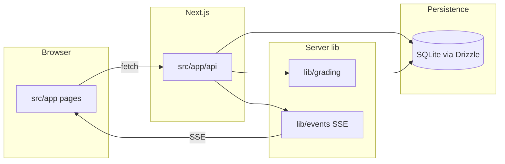

# Co-TA

AI-assisted grading for teaching assistants: a **Next.js 14** app (App Router) with **SQLite** + **Drizzle ORM**, **Zod** validation, and optional **OpenAI** grading behind a feature flag.

## Quick start

### Prerequisites

- **Node.js 20+** and **npm** (this repo uses `package-lock.json`)
- **Build toolchain for native modules** — `better-sqlite3` compiles on install; on macOS, Xcode Command Line Tools are usually enough

### Install and run

```bash
npm install
npm run db:push
npm run dev
```

Open [http://localhost:3000](http://localhost:3000).

### Environment variables

| Variable | Purpose |
|----------|---------|
| `DATABASE_URL` | Optional. Path to the SQLite file. If unset, the app uses `db/co-ta.db` under the project root (see [`db/index.ts`](db/index.ts)). |
| `USE_REAL_GRADING` | Set to `true` to use OpenAI instead of the deterministic stub (see [`lib/grading.ts`](lib/grading.ts)). |
| `OPENAI_API_KEY` | Required when `USE_REAL_GRADING=true`. The OpenAI SDK reads this from the environment. |

Create a `.env.local` in the project root (gitignored) or export variables in your shell. Stub grading works without an API key when `USE_REAL_GRADING` is not `true`.

### Database

- Schema and migrations live under [`db/`](db/).
- **`npm run db:push`** — apply schema to the DB (good for a fresh clone).
- **`npm run db:generate`** — generate migrations from schema changes.
- **`npm run db:studio`** — open Drizzle Studio.

SQLite `*.db` files are gitignored; each machine gets its own database unless you point `DATABASE_URL` elsewhere.

### Other scripts

| Command | Description |
|---------|-------------|
| `npm run dev` | Next.js dev server |
| `npm run build` | Production build |
| `npm run start` | Production server (after `build`) |
| `npm run lint` | ESLint |
| `npm test` / `npm run test:watch` | Vitest (tests use an in-memory DB via Vitest config) |

There is no Docker setup in this repo.

## Architecture at a glance



- **`src/app/`** — App Router: UI under route groups like `(pages)/`, HTTP handlers under `api/`.
- **`lib/`** — Grading logic, validation helpers, and in-process event bus for grading progress (consumed by SSE routes).
- **`db/`** — SQLite connection, Drizzle schema, and migrations.
- **`contracts/`** — Shared API and stream event types (e.g. [`contracts/types.ts`](contracts/types.ts)); use these for request/response shapes across UI and routes.

Typical flow: the TA creates assignments and uploads submissions via the API; batch grading runs server-side and emits events; the UI subscribes to **Server-Sent Events** for live updates while grading.

## Further reading

- **[ARCHITECTURE.md](ARCHITECTURE.md)** — API route reference, data flow, scoring rules, and SSE notes.
